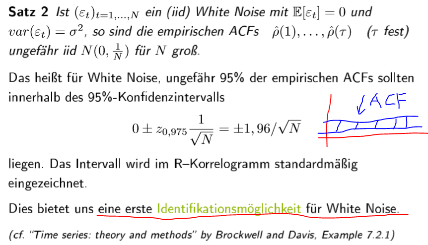
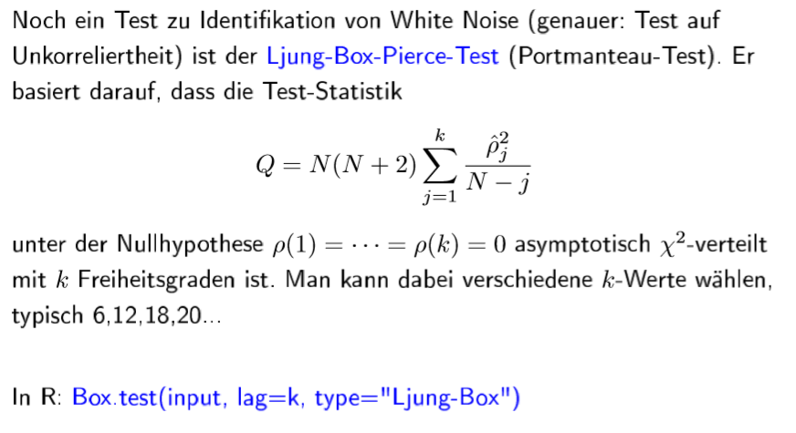
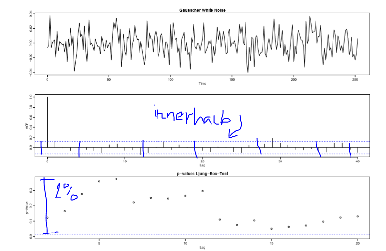
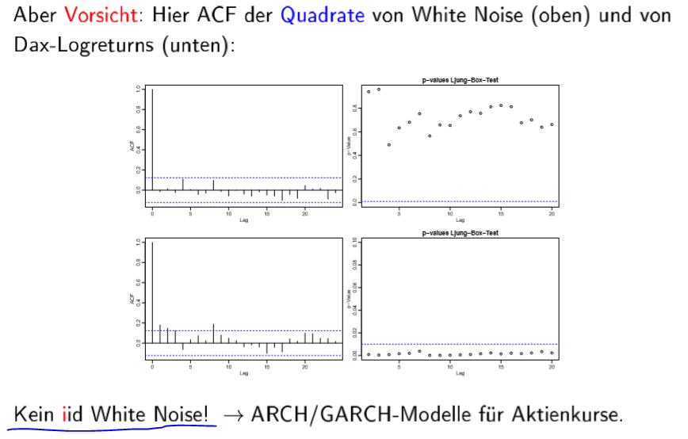

# 1.b Einführung und Grundlagen

## Wichtige Kennzahlen empirisch 

Skript Seite 2-24 bis Seite 2-26, R-skript Seite 2-28 / R-skript.R \#Die hypothetische Reihe 

\#1-Wichtige Kennzahlen empirisch 1

 \#2-Wichtige Kennzahlen empirisch 2

##  Wichtige Kennzahlen empirisch beispiel: Die hypothetische Reihe

\#1-hypothetische Zeitreihe 1

 \#2-hypothetische Zeitreihe 2

## Korrelogramm ACF

Skript Seite 2-30 bis Seite 2-36, R-skript Seite 2-31 / R-skript.R \#Korrelogramm: Beispiele

Der Graph der empirischen Autokorrelationsfunktion einer Zeitreihe wird als Korrelogramm bezeichnet. 

## Identifikation von White Noise 

Skript seite 2-38 bis seite 2-41

\#1-Identifikation von White Noise 

 \#2-Identifikation von White Noise

**VORSICHT**!!!!

## Schätzung von Parametern 

Skript seite 2-42 bis seite 2-44

## Ziel

