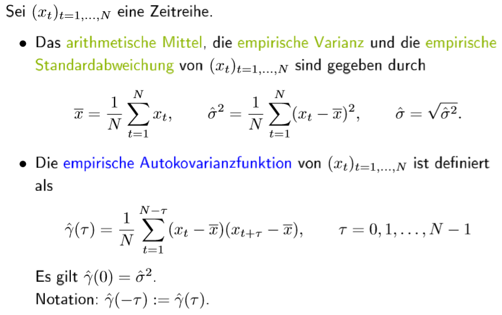
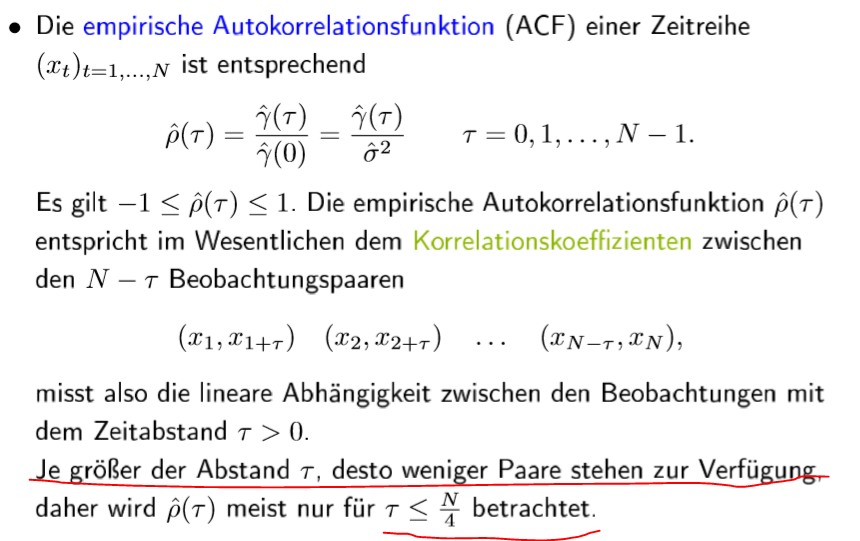
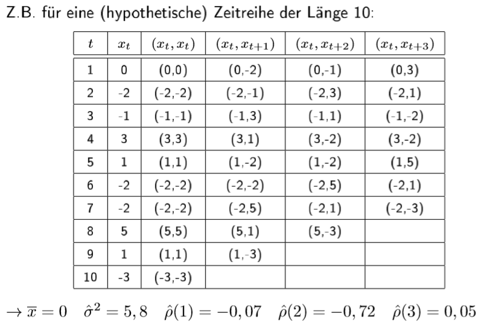
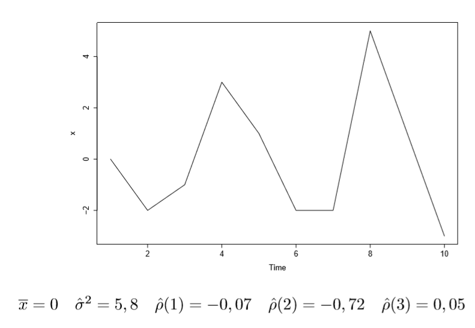

# 1.b Einführung und Grundlagen

## Wichtige Kennzahlen empirisch 

\#1-Wichtige Kennzahlen empirisch 1

 \#2-Wichtige Kennzahlen empirisch 2

##  Wichtige Kennzahlen empirisch beispiel: Die hypothetische Reihe

\#1-hypothetische Zeitreihe 1

 \#2-hypothetische Zeitreihe 2

