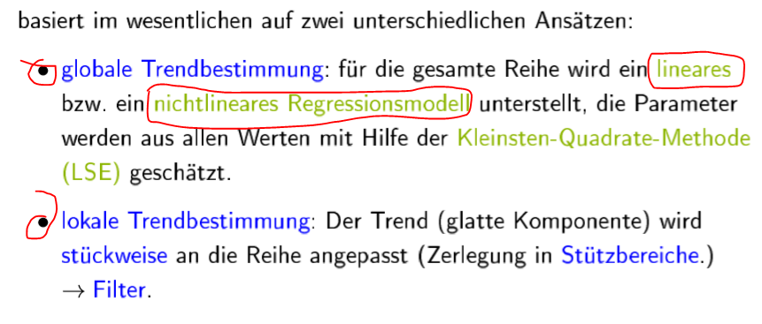
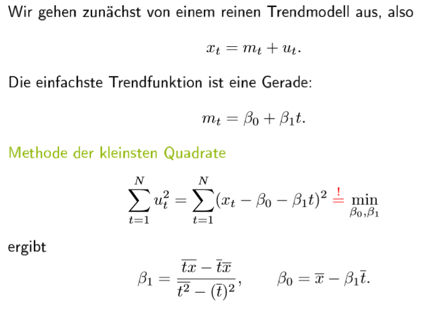
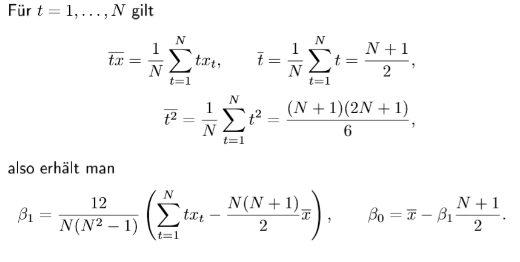

# 2. Klassische Zeitreihenanalyse

## Ziel

## Das klassische Komponentenmodell 

Skript seite 3-2 bis eite 3-5

## Transformation von Zeitreihen 

Skript seite 3-6 bis seite 3-10

## Trendbestimmung

## Globale lineare Trendbestimmung 

Skript seite 3-12 bis seite 3-24,  Skript R seite 3-18 und 3-19 , 3-21 / Skript-bsp.R \#Globale lineare Trendbestimmung: Beispiel

## Globale nichtlineare Trendbestimmung 

