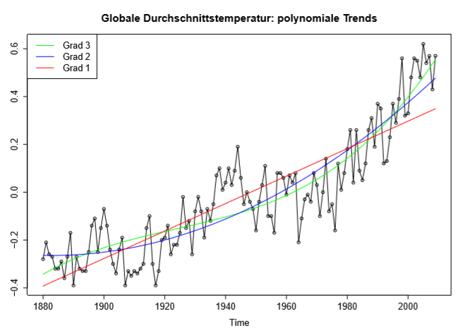
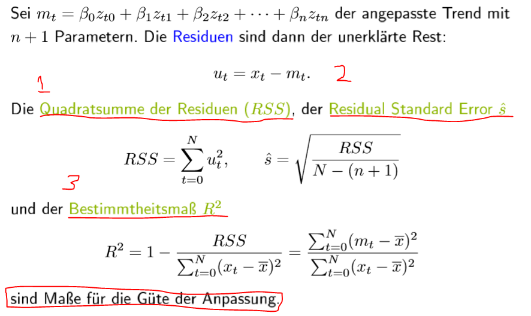
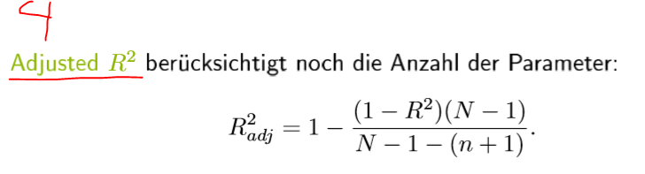
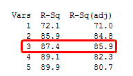

# 2.a Trendbestimmung

##  Trendbestimmung

##  Globale lineare Trendbestimmung

 Skript seite 3-12 bis seite 3-24, Skript R seite 3-18 und 3-19 , 3-21 / Skript-bsp.R \#Globale lineare Trendbestimmung: Beispiel

##  Globale nichtlineare Trendbestimmung

 Skript 3-22 bis 3-24, R-skript 3-24 / \#Globale nichtlineare Trendbestimmung

## Güte der Anpassung 

Skript 3-25 bis 3-39, 

**Gute der Anpassung: **

* 1. p-value muss kleiner als 1% oder 5%
  2. Die Variable muss signifikanz: Die Variable liegt in 95% oder 99% KI \(Befehl mit sterne \*\)
  3. Residuen Standard Error \(nummer 2\) soll kleiner wie möglich
  4. Bestimmheitmaß R2 \(nummer 3\) gegen 1 ist am Besten
  5. Optionl: Adjusten R2 \(zum vergleich die anzahl der parameter mit  Bestimmheitmaß R2

