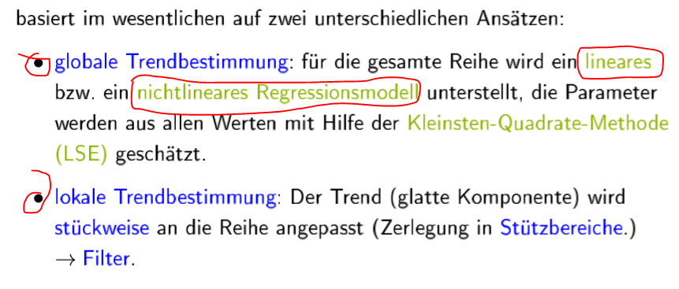
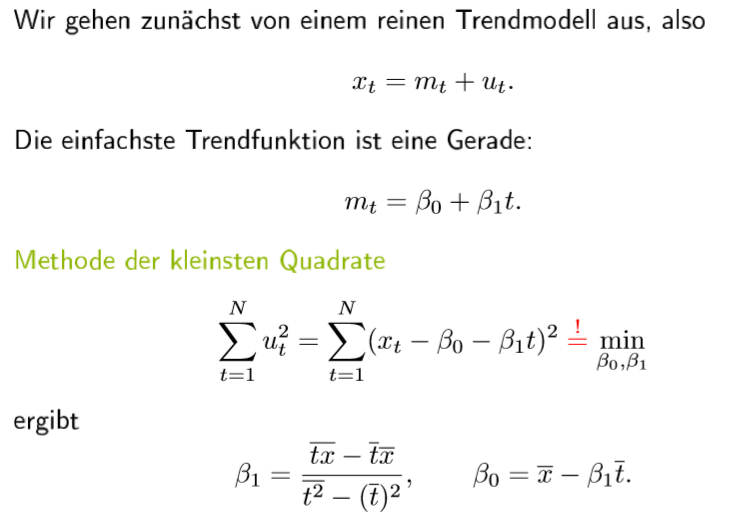

# 2.a Trendbestimmung

##  Trendbestimmung

##  Globale lineare Trendbestimmung

 Skript seite 3-12 bis seite 3-24, Skript R seite 3-18 und 3-19 , 3-21 / Skript-bsp.R \#Globale lineare Trendbestimmung: Beispiel

##  Globale nichtlineare Trendbestimmung

 Skript 3-22 bis 3-24, R-skript 3-24 / \#Globale nichtlineare Trendbestimmung

