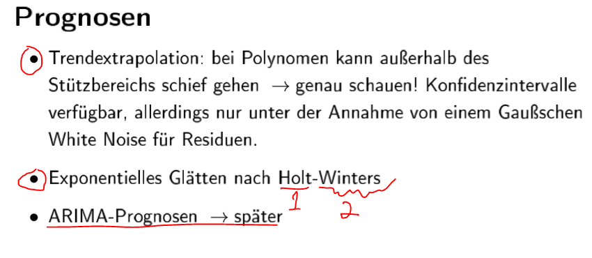
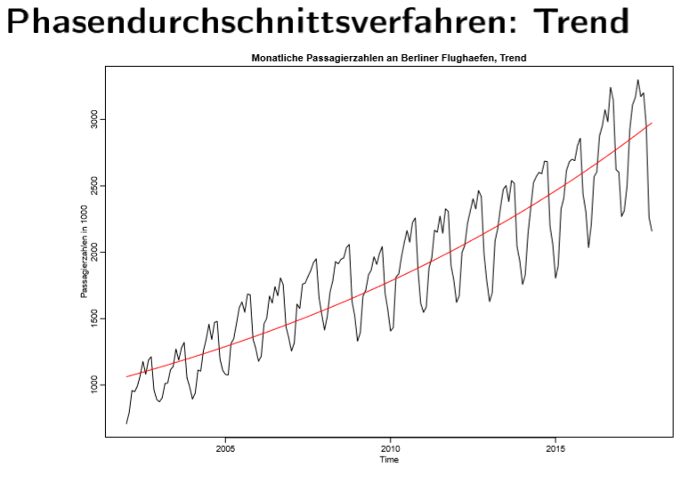
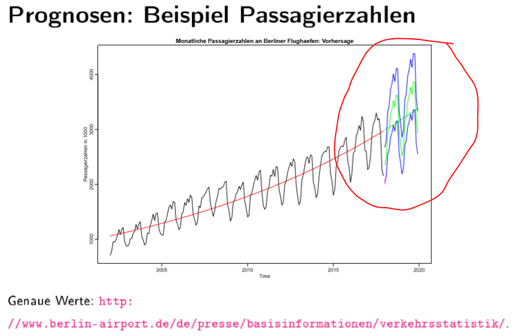
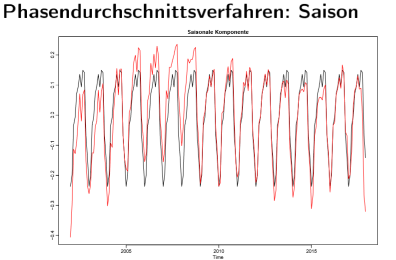
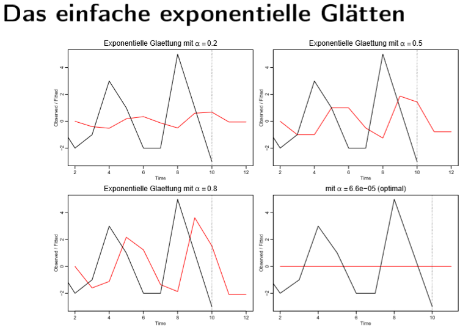

# 2.b Zeitreihen durch Filter \(lokale Trendbestimmung\)

Es gibt Ungerade und Gerade regel:

Fazit:

**Trend-bereinigen**:

* einfache gleitende durschnitt
* differenz filter-&gt;saisonale differenz filter

