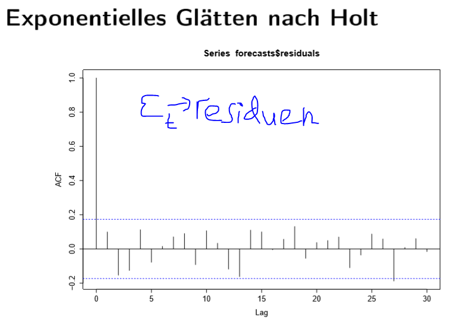

# 2.b Zeitreihen durch Filter \(lokale Trendbestimmung\)

Es gibt Ungerade und Gerade regel:

Fazit:

**Trendbereinigung**:

* e**infache gleitende durschnitt**
* **differenz filter-&gt;saisonale differenz filter**

