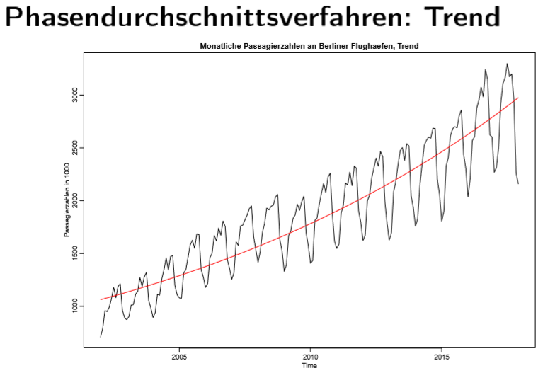
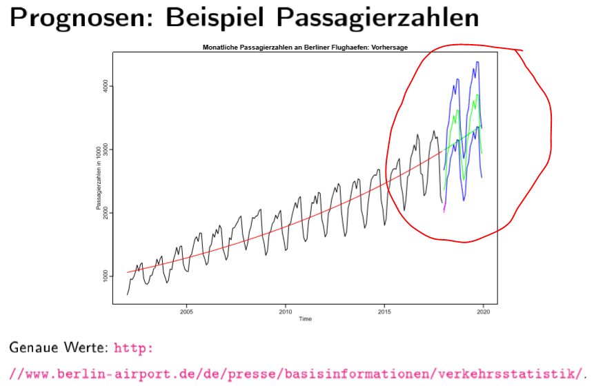

# 2.c Saisonbereinigung

## 1-Phasendurschnittsverfahren:

## 2-Regression Saison-Dummies \(Regression für Trend und Saison\)

## 3-Regression mit trigonometrischen Polynomen

## 4-Saisonbereinigung durch Differenzenbildung

## NOTE!

"decompose": einfache gleitenden durschnitt \(Trend und Saison Bereinigung\)

"stil"-&gt;forecast package: besser als decompose, differenzbildung +saison differenzbildung \(Trend und Saison Bereinigung\)

## 5-Anderen Verfahrens:

