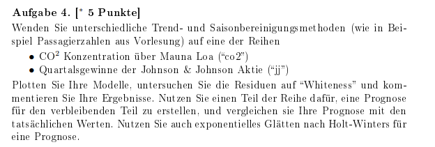

# blatt3\_aufgabe4



```r
# Zeitrihen braucht packages quantmod und astsa
# install.packages("astsa")
# install.packages("quantmod")
# library(astsa)
# library(quantmod)

#Trendbereinigung:
  #einfache gleitende durschnitt
  #differenzfilter

#Saisonbereinigung:
  #1-Phasendurschintt
    #einfache gleitende durschnitt
    #Differenzbildung
    
  #2-Regression mittels Saison-Dummies
  #3-Regression mit trigonometrische polynom
  #4-Differenzbildung (Saisonale)
  #Anderen Methoden: Berliner, Census


data() #zeigt die alle dataset

#get data from dataset
#CO2 Konzentration über Mauna Loa ("co2") 
datasets::co2 #sucht die datenset in R umgebung
?co2
co2
length(co2)
plot(co2) #Additive Modell
acf(co2) #Korrelation zu schauen
#Es gibt Multiplikative Modell und Additive Modell
#Multiplikative Modell: Varianz steigt sich
#Additive Modell: Varianz bleibt unverändern oder klein Änderung

#Quartalsgewinne der Johnson & Johnson Aktie ("jj")
datasets::JohnsonJohnson
data()
jj #from astsa packages
length(jj) #Anzahl der daten
plot(jj) #Multiplikative Modell , also mit Log
acf(jj)

######Einfache gleitende Durchschnitte mit verschiedenen Stützbereichen. (Filter, Glättung)#####

# Stützbereich Funktion
SB = function(dataset, n){
  sb<-n%%2 #ungerade Stützbereich
  if(sb == 1){
    vt <- rep(1/n, n)}
  else{
    vt <- c( .5, rep(1, n - 1), .5) / n } #gerade Stützbereich
  linear_filtering <- filter(dataset, sides = 2, filter = vt) #http://stat.ethz.ch/R-manual/R-devel/library/stats/html/filter.html
  return(linear_filtering)
}

# Die Stützbereichen
v5 <- SB(co2,5)
v12 <- SB(co2,12) #Saisonale einfache durschnitt, denn es ist monatliche Daten
v25 <- SB(co2,25)
v50 <-SB(co2,50)
#Je mehr die Stutzbereich, also desto ist mehr Glätten
#Ungerade-> M=2n+1, Also Vt=N-2n
#Gerade->M=2n, Also Vt=N-2n

#Preparing the graphs wall
par(mfrow=c(2,2), mar=c(3,2,1,0)+.5, mgp=c(1.6,.6,0))

#All graphs
plot.ts(co2, main="CO2 Konzentration über Mauna Loa")
lines(v5,  col = "red" ,lwd = 2)
legend("topleft","M=5")

plot.ts(co2, main="CO2 Konzentration über Mauna Loa")
lines(v12, col = "blue"    ,lwd = 2)
legend("topleft","M=12")

plot.ts(co2, main="CO2 Konzentration über Mauna Loa")
lines(v25, col = "green" ,lwd = 2)
legend("topleft","M=25")

plot.ts(co2, main="CO2 Konzentration über Mauna Loa")
lines(v50, col = "orange" ,lwd = 2)
legend("topleft","M=50")


#Quartalsgewinne der Johnson & Johnson Aktie ("jj")
#Preparing the graphs wall

# Die Stützbereichen
#jj ist Multiplikative Modell, folgt mit Log
jj
log(jj)
plot(log(jj))
v5 <- SB(log(jj),5)
v12 <- SB(log(jj),12)
v25 <- SB(log(jj),25)
v50 <-SB(log(jj),50)
#Je mehr die Stutzbereich, also desto ist mehr Glätten
#Ungerade-> M=2n+1, Also Vt=N-2n
#Gerade->M=2n, Also Vt=N-2n

par(mfrow=c(2,2), mar=c(3,2,1,0)+.5, mgp=c(1.6,.6,0))

#All graphs
plot.ts(log(jj), main="Quartalsgewinne der Johnson & Johnson Aktie")
lines(v5,  col = "red" ,lwd = 2)
legend("topleft","M=5")

plot.ts(log(jj), main="Quartalsgewinne der Johnson & Johnson Aktie")
lines(v12, col = "blue"    ,lwd = 2)
legend("topleft","M=12")

plot.ts(log(jj), main="Quartalsgewinne der Johnson & Johnson Aktie")
lines(v25, col = "green" ,lwd = 2)
legend("topleft","M=25")

plot.ts(log(jj), main="Quartalsgewinne der Johnson & Johnson Aktie")
lines(v50, col = "orange" ,lwd = 2)
legend("topleft","M=50")

#####Differenzbildung/Differenzfilter: Trendbereinigung#####

#CO2 Konzentration über Mauna Loa ("co2") 
windows()
length(co2)
diff(co2,12)
length(diff(diff(co2,12),12))
length(diff(co2,12))
par(mfrow=c(2,2), mar=c(3,2,1,0)+.5, mgp=c(1.6,.6,0))
plot(co2, main="CO2 Konzentration über Mauna Loa")
plot(diff(co2), main="co2: 1. Differenz")
plot(diff(co2,12), main="co2: saisonale Differenz")
plot(diff(diff(co2),12), main="co2: Trend- und Saisondifferenzen")

windows()
par(mfrow=c(2,2), mar=c(3,2,1,0)+.5, mgp=c(1.6,.6,0))
acf(co2,40)
acf(diff(co2),40)
acf(diff(co2,12))
acf(diff(diff(co2),12),40)

#Quartalsgewinne der Johnson & Johnson Aktie ("jj")
#Multiplikative Modell, folgt mit Log
windows()
par(mfrow=c(2,2), mar=c(3,2,1,0)+.5, mgp=c(1.6,.6,0))
plot(log(jj), main="Quartalsgewinne der Johnson & Johnson Aktie")
plot(diff(log(jj)), main="jj: 1. Differenz")
plot(diff(log(jj),12), main="jj: saisonale Differenz")
plot(diff(diff(log(jj)),12), main="jj: Trend- und Saisondifferenzen")

windows()
par(mfrow=c(2,2), mar=c(3,2,1,0)+.5, mgp=c(1.6,.6,0))
acf(log(jj),40)
acf(diff(log(jj)),40)
acf(diff(log(jj),12))
acf(diff(diff(log(jj)),12),40)

#####Phasendurschnittverfahren: saisonale Zerlegung mit polynomial Regression#####
#ab seite 3-68
#CO2 Konzentration über Mauna Loa ("co2") 
## 1-linearer globaler Trend 
rm(list=ls())
co2
t=c(1:length(co2))
t2=t^2
t3=t^3
fit=lm(co2~t+t2+t3)
summary(fit)
plot(co2, main="CO2 Konzentration über Mauna Loa,Trend", ylab="")
trend=ts(fit$fitted.values, frequency=12,start=1959)
lines(trend, col=2)

## 2-Saisonale Residuen
sr=co2-trend
plot(sr, main="Trendbereingung (linear)", ylab="")

## Monatsdurchschnitte ueber die Jahre
cycle(sr) #return the month number
sais1=tapply(sr, cycle(sr), mean) #taply: Apply A Function Over A Ragged Array
sais1
mean(sais1)
saison1=sais1-mean(sais1)
saison1

#3-Zeitreihe machen Residuen
smm=ts(rep(saison1, length(co2)/12), frequency=12, start=c(1959,1))
smm
plot(smm, main="Saisonale Komponente", ylim=c(min(smm, sr), max(smm, sr)))
lines(sr, col=3)

#4-zurueck zum Modell 
mm=trend+smm
mm
plot(co2, main="co2: additive saisonale Zerlegung", ylab="")
lines(mm, col=2)

#Fehleranalyse
resm=co2-mm
resm
plot(resm)
par(mfrow=c(2,2), mar=c(3,2,1,0)+.5, mgp=c(1.6,.6,0))
qqnorm(resm) #unab & normal verteilt testen
qqline(resm) #unab & normal verteilt testen
acf(resm) #unkoreliert testen

#Quartalsgewinne der Johnson & Johnson Aktie ("jj")
#Mit log denn jj ist Multiplikative Modell (Varianz steigt sich)
## 1-linearer globaler Trend 
rm(list=ls())
log(jj)
t=c(1:length(log(jj)))
t2=t^2
t3=t^3
fit=lm(log(jj)~t+t2+t3)
summary(fit)
plot(log(jj), main="Quartalsgewinne der Johnson & Johnson Aktie,Trend", ylab="")
trend=ts(fit$fitted.values, frequency=4,start=1960)
lines(trend, col=2)

## 2-Saisonale Residuen
sr=log(jj)-trend
sr
plot(sr, main="Trendbereingung (linear)", ylab="")

## Monatsdurchschnitte ueber die Jahre
cycle(sr) #return the month number
sais1=tapply(sr, cycle(sr), mean) #taply: Apply A Function Over A Ragged Array
sais1
mean(sais1)
saison1=sais1-mean(sais1)
saison1

#3-Zeitreihe machen Residuen
smm=ts(rep(saison1, length(co2)/4), frequency=4, start=c(1960,1))
smm
plot(smm, main="Saisonale Komponente", ylim=c(min(smm, sr), max(smm, sr)))
lines(sr, col=3)

#4-zurueck zum Modell 
trend
smm
mm=trend+smm
mm
plot(log(jj), main="Passagierzahlen: multiplikative saisonale Zerlegung", ylab="")
lines(mm, col=2)

#Fehleranalyse
resm=log(jj)-mm
resm
plot(resm)
qqnorm(resm)
qqline(resm)
acf(resm)

#####Phasendurschnittverfahren:Trend ueber gleitende Durchschnitte#####

#CO2 Konzentration über Mauna Loa ("co2") 
co2
rm(list=ls())
#1-als Funktion: einfache gleitende durschnitt
MA=function(mydata, n){d=n%%2
if(d==1){w=rep(1/n,n)}else{w=c(.5, rep(1,n-1), .5)/n}
ans= filter(mydata, sides=2, filter=w) 
return(ans)
}

trendg=MA(co2, 12) #monatlich
trendg=na.omit(trendg) #
(ts.intersect(co2, trendg))

#2-Saisonale Komponente
smg=co2-trendg
plot(smg)

## Monatsdurchschnitte ueber die Jahre
saisong=tapply(smg, cycle(smg), mean)

#3-Zeitreihe machen
smmg=ts(rep(tapply(smg, cycle(smg), mean), length(co2)/12), frequency=12, start=c(1959,1))
plot(smmg, main="Saisonale multiplikative Komponente")

#4-zuruek zum Modell 
mmg=trendg+smmg
plot(co2, main="Passagierzahlen: saisonale Zerlegung mit gleitenden Durchschnitten", ylab="Passagierzahlen in 1000")
lines(exp(trendg), col=4)
lines(mmg,col=2)

#Fehleranalyse
resm=co2-mmg
plot(resm)
qqnorm(resm)
qqline(resm)
acf(resm, 40)

#Quartalsgewinne der Johnson & Johnson Aktie ("jj")
#jj ist Multiplikative Modell
log(jj)
rm(list=ls())
#1-als Funktion: einfache gleitende durschnitt
MA=function(mydata, n){d=n%%2
if(d==1){w=rep(1/n,n)}else{w=c(.5, rep(1,n-1), .5)/n}
ans= filter(mydata, sides=2, filter=w) 
return(ans)
}

trendg=MA(log(jj), 4) #quartal
trendg=na.omit(trendg) #
(ts.intersect(jj, trendg))

#2-Saisonale Komponente
smg=log(jj)-trendg
plot(smg)

## Monatsdurchschnitte ueber die Jahre
saisong=tapply(smg, cycle(smg), mean)


#3-Zeitreihe machen
smmg=ts(rep(tapply(smg, cycle(smg), mean), length(jj)/4), frequency=4, start=c(1960,1))
plot(smmg, main="Saisonale multiplikative Komponente")

#4-zuruek zum Modell 
mmg=trendg+smmg
plot(log(jj), main="Passagierzahlen: saisonale Zerlegung mit gleitenden Durchschnitten", ylab="")
lines(trendg, col=4)
lines(mmg,col=2)

#Fehleranalyse
resm=log(jj)-mmg
plot(resm)
qqnorm(resm)
qqline(resm)
acf(resm, 40)

?decompose()
## direkt mit decompose
#co2
plot(co2)
decompose(co2, type = "multiplicative") 
dec=decompose(co2)
plot(dec)
plot(co2, main="co2: saisonale Zerlegung mit decompose", ylab="")
lines((dec$trend), col=4)
lines((dec$seasonal+dec$trend), col=2)

#jj
plot(log(jj))
decompose(log(jj), type = "multiplicative") 
dec=decompose(log(jj))
plot(dec)
plot(log(jj), main="jj: saisonale Zerlegung mit decompose", ylab="")
lines((dec$trend), col=3)
lines((dec$seasonal+dec$trend), col=2)

#####Regression mittels Saison Dummies: Regression mit saisonalen Variablen#####
#co2
rm(list=ls())
t=c(1:length(co2))
(Q = factor(cycle(co2))) # Saisonvariablen
reg0 = lm(log(co2)~0 + t + Q, na.action=NULL) #homogen
model.matrix(reg0) # Model Matrix
summary(reg0)
plot(co2, main="Regression mit saisonalen Variablen", ylab="")
lines((fitted.values(reg0)), col="red")
lines(mm, col=4) #from the Phasendurschnittverfahren: saisonale Zerlegung mit polynomial Regression 

#jj
# rm(list=ls())
# t=c(1:length(jj))
# (Q = factor(cycle(jj))) # Saisonvariablen
# reg0 = lm(log(jj)~0 + t + Q, na.action=NULL) #homogen
# model.matrix(reg0) # Model Matrix
# summary(reg0)
# plot(co2, main="Regression mit saisonalen Variablen", ylab="")
# lines((fitted.values(reg0)), col="red")
# lines(mm, col=3) #Phasendurschnittverfahren: saisonale Zerlegung mit polynomial Regression

#####Regression mit trigonometrischen Polynomen#####
#co2
t<-1:length(co2)
z1 = cos(pi*t/6)
z2 = sin(pi*t/6)
tfit <-lm(co2~t+z1+z2)
summary(tfit <- lm(co2~t+z1+z2)) 
plot(co2, main="Regression mit trigonometrischen Polynomen", ylab="")
lines(ts((fitted.values(tfit)), frequency=12, start=c(1959,1)), col=4)

# mehr triginometrische terme
z3 = cos(pi*t/6*2); z4 = cos(pi*t/6*3)
z5 = sin(pi*t/6*2); z6 = sin(pi*t/6*3)
summary(tfit3 <- lm(co2~t+z1+z2+z3+z4+z5+z6)) 
summary(tfit3a <- lm(co2~t+z1+z2+z3)) 

plot(co2, main="Regression mit trigonometrischen Polynomen", ylab="")
lines(ts((fitted.values(tfit)), frequency=12, start=c(1959,1)), col=4)
lines(ts((fitted.values(tfit3a)), frequency=12, start=c(1959,1)), col="red")
legend("topleft", c(expression(paste("2 Terme")),
                    expression(paste("4 Terme"))), 
       lwd = 1, cex=1, col=c(4,"red"), pt.lwd = 1) 

par(mfrow=c(2,2), mar=c(3,2,1,0)+.5, mgp=c(1.6,.6,0))
plot.ts(resid(tfit)) # residuals - reg$resid ist dasselbe als resid(reg) 
plot.ts(resid(tfit3a))
qqnorm(resid(tfit))
qqline(resid(tfit))
qqnorm(resid(tfit3a))
qqline(resid(tfit3a))
acf(resid(tfit),40)
acf(resid(tfit3a),40)


###### Vergleich der Modelle ###################
Rquadrat = function(fit, mydata) 
{ans = 1- var(mydata-fit)/var(mydata)
return(ans)
}
# Rquadrat(mm,co2)  #Phasenverfahren: Polynom Regresion
# Rquadrat(mmg,co2) #Phasenverfahren: gleitende Durschnitt
# Rquadrat((fitted.values(reg0)),co2) #Regression mittels Saison Dummies
# Rquadrat((fitted.values(tfit)),co2)  #Regression mit trigonometrischen Polynomen 2
# Rquadrat((fitted.values(tfit3a)),co2) # mehr triginometrische terme polynom 6

AIC(reg0,tfit,tfit3a)
BIC(reg0,tfit,tfit3a)

######prognose######

########## mit stl benoetigt das Paket forecast ####################
##### mit stl, besser als decompose! #############

dec.co2=stl(co2, "per")
plot(dec.co2) 
plot(co2, main="co2: saisonale Zerlegung mit stl", ylab="")
lines((dec.co2$time.series[,2]), col=4)
lines((dec.co2$time.series[,2]+dec.co2$time.series[,1]), col=2)

#Residuen
resp=dec.co2$time.series[,3]
plot(resp)                  
qqnorm(resp)
qqline(resp)
acf(resp,40)

Rquadrat(exp(dec.co2$time.series[,2]+dec.co2$time.series[,1]), co2)

co2
install.packages("forecast")
library(forecast)
plot(forecast(dec.co2), main="Forecast stl fuer co2")
dec.co2
plot(co2, main="co2: Vorhersage", ylab="")
lines((forecast(dec.co2)$mean), col="green", lwd=2)
lines((forecast(dec.co2)$lower[,2]), col="blue", lwd=2)
lines((forecast(dec.co2)$upper[,2]), col="blue", lwd=2)
lines(co2, col=6, lwd=2)

############# Holt-Winters #########################################
rm(list=ls())

#co2
(hw.co2m = HoltWinters(co2))
list(hw.co2m)
(pm=predict(hw.co2m, n.ahead = 24))
hw.co2m
plot(hw.co2m,pm, main="co2: Multiplikative Holt-Winters-Glaettung")
lines(co2, col=4)
#oder
 hw.co2 <- forecast(hw.co2m, h=24)
 plot(hw.co2)
 
 res=na.omit(hw.co2$residuals)
 plot(res)
 acf(res)
 Box.test(res, lag=30, type="Ljung-Box")

 qqnorm(res, main="Normal QQ-Plot")  # qq-plots: Test auf unab und normal verteilt
 qqline(res, col=2)
 
 hist(res, prob=TRUE, 20)   # histogram : Test auf unab und normal verteilt
 lines(density(res))
 dn=dnorm(x=seq(min(res),max(res),length.out=500), mean(res), sd(res))
 lines(x=seq(min(res),max(res),length.out=500), dn, col=2)
```

[Lösung: 3uebungsblatt\_4](https://trello.com/c/qr0XVFNj/24-3uebungsblatt4)

