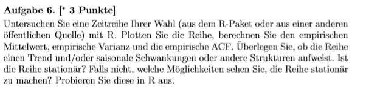
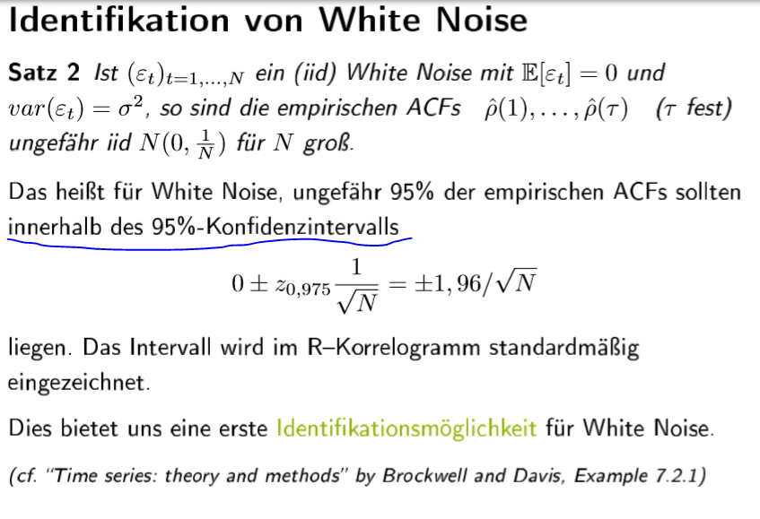

# blatt1\_aufgabe6



**Gute der Anpassung ACF Stationarität:**



**Auswirken Anzahl der Beobachtungen:**


```r
install.packages("astsa")  #installieren
install.packages("quantmod") 
library(astsa)            #laden
require(quantmod)         #dasselbe wie library

rm(list=ls())
?LakeHuron     
LakeHuron         
length(LakeHuron) # Länge der Datenreihe
View(LakeHuron)   # Anzeige in separatem Reiter 
par(mfrow=c(1,1), mar=c(3,2,1,0)+.5, mgp=c(1.6,.6,0))
plot(LakeHuron, main="Level of Lake Huron 1875-1972")

#### Erwartungswert=Mittelwert (empirisch), Varianz, St.abw. & ACF berechnen ####

#Mittelwert berechnen
mw=mean(LakeHuron)
mw

#Mittelwert in Plot hinzufügen
x=c(1875:1972,1)
#length(x)
y=rep(mw,99)
#length(y)
lines(x,y,col=2)

#Varianz berechnen
var(LakeHuron) 

#Standardabweichung berechnen
std=sd(LakeHuron) 
std

# std einzeichnen
z1=rep(std+mw,99)
z2=rep(-std+mw,99)
#length(y)
lines(x,z1,col=5)
lines(x,z2,col=5)

#ACF berechnen
acf(LakeHuron, plot = FALSE) 
acf(LakeHuron)

# Die ACF misst die lineare Abhängigkeit zwischen den Beobachtungen 
# mit dem Zeitabstand tau > 0. 
#Je größer der Abstand tau, desto weniger Paare stehen zur Verfügung, 
# daher wird die ACF(tau) meist nur für tau<= N/4 betrachtet. 
#Hier sind N/4 = 98/4 =24,5

# Saisonalität ->nicht erkennbar
# für Saisonalität ACF plotten:
par(mfrow=c(4,1), mar=c(2,2,3,1), cex.main=1)
acf(LakeHuron,20,main="ACF bis Lag 20")
acf(LakeHuron,50,main="ACF bis Lag 50")
acf(LakeHuron,100,main="ACF bis Lag 100")
acf(LakeHuron,200,main="ACF bis Lag 200")

# Trend ->erkennbar
# Trenduntersuchung:
fit = lm(LakeHuron~time(LakeHuron)) #Fitting mittels linearer Regression
fit$coefficients # Anzeige der Regressionskoeffizienten
par(mfrow=c(1,1))
plot(LakeHuron, main="Level of Lake Huron 1875-1972: linearer Trend", ylab="")
lines(ts(fit$fitted.values, frequency = 1, start=1875), col=2)
# Abwärtstrend erkennbar

#Stationarität Prüfen, 
library(tseries)
adf.test(LakeHuron)
# Ist die Reihe stationär? Falls nicht, welche Möglichkeiten sehen Sie, die Reihe 
# stationär zu machen? Probieren Sie diese in R aus.'

# im Mittel fallender Trend -> ZR ist nicht erwartungswert-stationär
# -> Trend abziehen
LHneu=rep(1,98)
for (i in 1:98)
{LHneu[i]=LakeHuron[i] - i*fit$coefficients[2]}
LHneu

mean(LHneu)

as.ts(LHneu, start = 1875, end = 1972, frequency = 1)
plot(LHneu, main="Level of Lake Huron 1875-1972: linearer Trend abgezogen", ylab="")
fit2 = lm(LHneu~time(LHneu)) #Fitting mittels linearer Regression
fit2$coefficients # Anzeige der Regressionskoeffizienten
lines(ts(fit2$fitted.values, frequency = 1, start=1), col=2) 
acf(LHneu,100,main="ACF LHneu mit Lag bis 100")

# Trends und ACFs im Vergleich
par(mfrow=c(2,1), mar=c(2,2,3,1), cex.main=1)
plot(LakeHuron, main="Level of Lake Huron 1875-1972: linearer Trend", ylab="")
lines(ts(fit$fitted.values, frequency = 1, start=1875), col=2)
plot(LHneu, main="Level of Lake Huron 1875-1972: linearer Trend abgezogen", ylab="")
lines(ts(fit2$fitted.values, frequency = 1, start=1), col=2) 
# -> kein Trend mehr

par(mfrow=c(2,1), mar=c(2,2,3,1), cex.main=1)
acf(LakeHuron,100,main="ACF LakeHuron mit Lag bis 100")
acf(LHneu,100,main="ACF LHneu mit Lag bis 100")
# -> gemilderte Korrelationen, Verdacht auf Saisonalität 
# -> ZR müsste noch saisonbereinigt werden, allerdings müsste die Periode ermittelt werden

par(mfrow=c(2,1), mar=c(2,2,3,1), cex.main=1)
acf(LakeHuron, type = "covariance",50, main="Autokovarianzfkt. mit Lag bis 50")
acf(LakeHuron, type = "correlation",50, main="ACF mit Lag bis 50")
```

R file:

[Lösung: 1uebungsblatt\_6](https://trello.com/c/DS3c0IxL/22-1uebungsblatt6)

