# 1. Einführung und Grundlagen

## Legende:

* ZV:= Zufallsvariablen
* WN:= White Noise
* EW:= Erwartungswert
* Var:= Varianz

### **Zeitreihe**: Skript Seite 1-1, bsp Seite. 1-2 bis Seite. 1-18, R-skript bsp Seite.8 / Skript-bsp.R \#Zeitreihe einführung

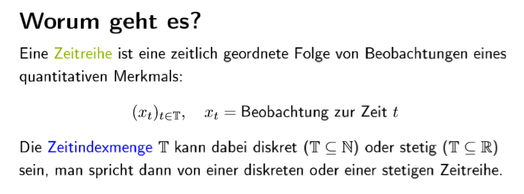

### **Stochastischer Prozess**: Skript Seite 2-1

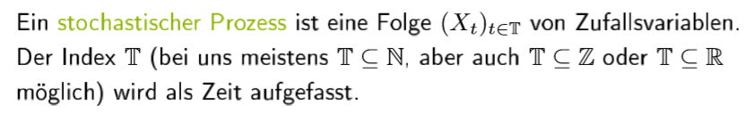

und **zeireihe: **Skript Seite 2-1

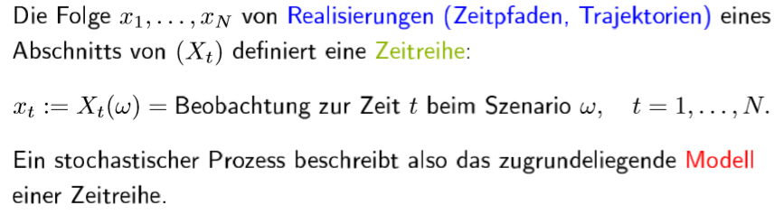


Ein Zeitreihe: einen folgen

Ein stoch.prozesse: zeitlich geordnete Zufallsvariable in Zufallsprozesse

Zeitreihe mit stoch.prozesse: einen folgen, die Zufallsvariablen sind


### **Beispiel stoch.prozesse: Skript, Seite 2-2 bis Seite 2-12 **

**\#1-Gaußprozesse**: die ZV von folgen \(Zeitreihen\) sind [normalverteilt ](https://de.wikipedia.org/wiki/Normalverteilung)oder die Zeitreihe sind normalverteilt. 

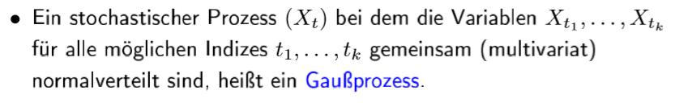

**\#2-White Noise**: die iid ZV von folgen \(Zeitreihen\) hat endlichen EW und Var. Oft sind WN zentriert sind, also EW=0 ist. Notation für WN : \(εt\) ∼ WN\(µ,σ2\). 

Skript Seite 2-4 bis Seite 2-5, R-skript Seite 2-7 / Skript-bsp.R: \#White Noise

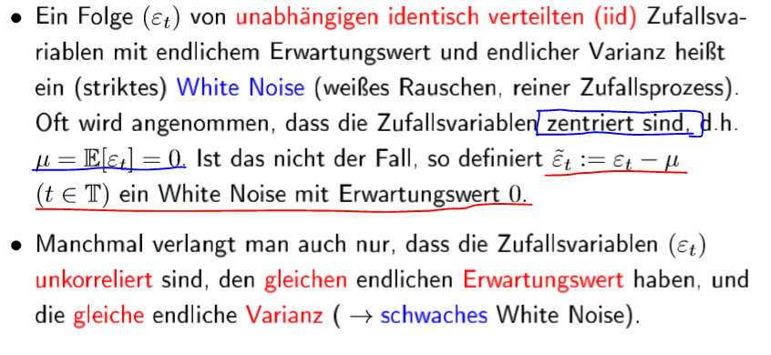

**\#3-Gausssche WN: 2. punkte: Denn Gauss selbst ist schon Unabhängig**

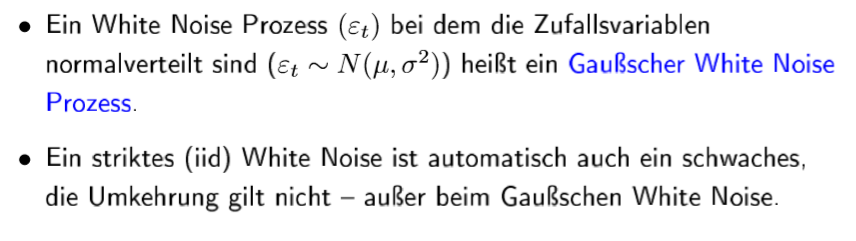

**\#4-Random Walk: **kumulierte WN

Skript Seite 2-10 & 2-11, R-skript Seite 2-12 / Skript-bsp.R \#Random Walk

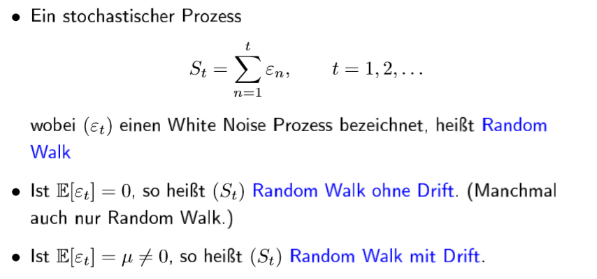

anderen Schreibweise von RW

----1

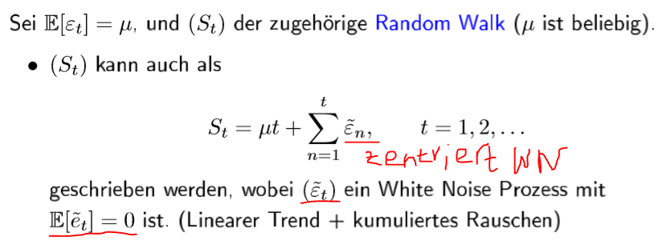

----2

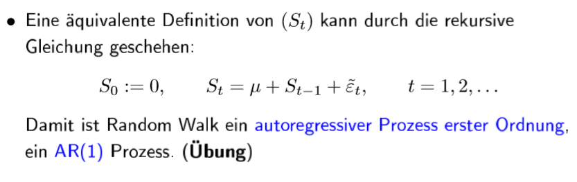

### Wichtige Kennzahlen von Xt \(ZV von Folgen\):

\#EW und Var

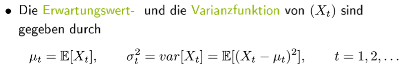

\#Kovarianz und Korrelation

Kovarianz: Lineare zusammenhäng von X und Y

Korrelation: Standardisierte Kovarianz

\#Autokovarianzfunktion 

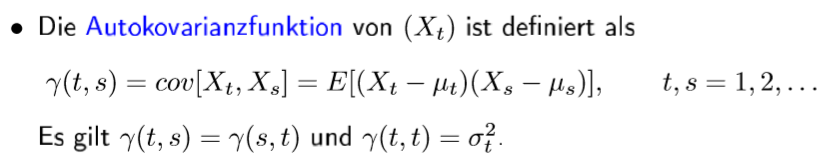

\#Autokorrelationsfunktion

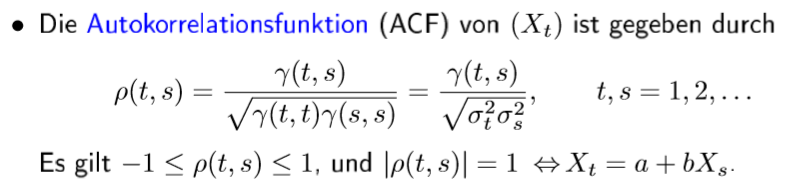

\#Stationär

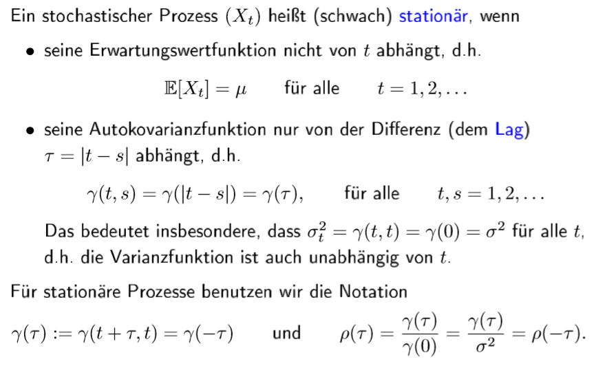

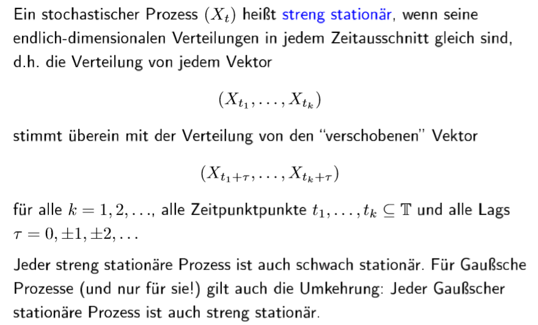

\#Kurze Erinnerung: Kovarianzen

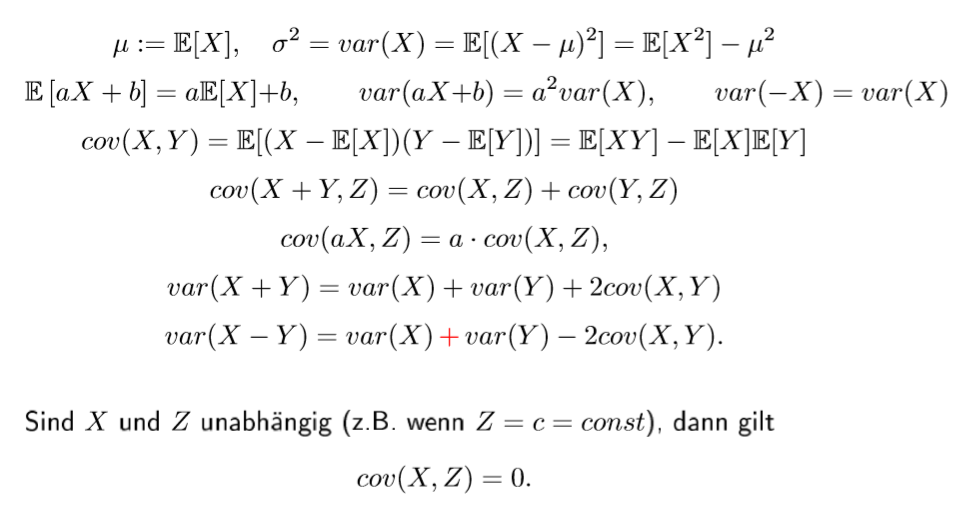

